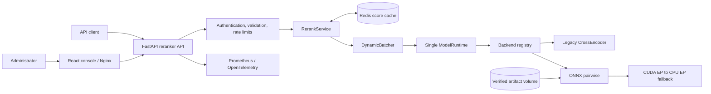

# Reranker Service

[Русский](README.ru.md) | **English**

Reranker Service is an independent FastAPI cross-encoder service and administration console. It
scores domain-agnostic `query + document` pairs with the pinned
`BAAI/bge-reranker-v2-m3@953dc6f6f85a1b2dbfca4c34a2796e7dde08d41e` model. Its default
production path is ONNX Runtime with CUDA and controlled CPU fallback. It supports Redis score caching,
bounded dynamic batching, batch requests, Prometheus/OpenTelemetry observability, and graceful
cache degradation.

## What is included

- authenticated single-request and batch reranking APIs;
- stable ranking that preserves input order when scores are equal;
- one immutable model revision and one active model runtime per container;
- a backend registry with typed capabilities for ONNX, legacy CrossEncoder, Alibaba GTE pairwise,
  and Jina listwise runtimes;
- checksum-verified, versioned ONNX artifact manifests keyed by model, full revision, backend, and
  precision;
- candidate model validation, warm-up, activation, and rollback controls;
- Redis caching with SHA-256-only keys and inference-safe degradation;
- a React administration console with playgrounds, benchmarks, metrics, runtime controls, and
  technical request history with expandable per-request detail (query, scored results, documents);
- versioned browser-local persistence for the single-request Playground's last query, ordered
  documents with metadata, and top-N; clearing is explicit and credentials are never included;
- isolated ONNX GPU, ONNX CPU, exporter, legacy, Jina, and Alibaba Docker targets.

The API is available at `http://localhost:8200`; the administration console is at
`http://localhost:8400`.

## Architecture

The service follows the compact component-and-data-flow style used by
`job-searching-assistant`: the API owns contracts and orchestration, the runtime owns model
inference, and Redis remains an optional cache rather than a readiness dependency.



The web container only serves the console and reverse-proxies HTTP. FastAPI owns authentication,
validation, request limits, stable response contracts, and technical audit records. `RerankService`
coordinates hashed cache lookup and bounded inference. `DynamicBatcher` combines pairs without
mixing request identity, while `ModelRuntime` owns the single active model and executor.
Framework-specific load, warm-up, provider validation, rerank, and unload behavior remains inside
each backend.
Redis failures reduce cache effectiveness but never make inference or readiness fail.

## Install from scratch on Windows

Requirements: Windows 10 or 11, PowerShell 5.1 or newer, Docker Desktop with Compose v2, at least
8 GB RAM, and approximately 12 GB free disk space for the exporter, runtime, and model artifact.

```powershell
git clone https://github.com/Sa1avatus/reranker-service.git
Set-Location reranker-service
Set-ExecutionPolicy -Scope Process Bypass
.\scripts\install.ps1
```

The installer verifies Docker, creates an ignored `.env` with independent random API and admin
secrets, explicitly prepares the pinned ONNX artifact through the exporter, builds the GPU runtime,
starts Redis/API/web, and waits for local load/warm-up. It never overwrites an existing `.env`.
Use `.\scripts\install.ps1 -Cpu` on a host without NVIDIA passthrough. The first installation can
take 10–30 minutes, depending on network and CPU speed.

When readiness succeeds, open `http://localhost:8400`. Read the admin token only from your local
`.env`; never paste it into logs or commit it.

```powershell
docker compose ps
docker compose logs -f reranker-api
docker compose down
# Data is preserved. Add -v only when you intentionally want to delete model and Redis volumes.
```

Rerunning `.\scripts\install.ps1` is safe. Use `-SkipBuild` when the image is current, or
`-ReadyTimeoutMinutes 60` on a slow first download.

## Manual quick start

```powershell
Copy-Item .env.example .env
# Replace both placeholder secrets before starting the service.
docker compose --profile exporter build reranker-exporter
docker compose --profile exporter run --rm reranker-exporter `
  --model-id BAAI/bge-reranker-v2-m3 `
  --revision 953dc6f6f85a1b2dbfca4c34a2796e7dde08d41e `
  --precision fp32 `
  --score-transform sigmoid
docker compose up -d --build
Invoke-RestMethod http://localhost:8200/health/ready
```

For local-only development you may use disposable development secrets. Never deploy them.

```powershell
$body = @{
  query = 'Kubernetes experience'
  documents = @(
    @{ id = 'a'; text = 'Ran Kubernetes in production' }
    @{ id = 'b'; text = 'SQL Server administrator' }
  )
  top_n = 2
} | ConvertTo-Json -Depth 4

Invoke-RestMethod -Method Post -Uri http://localhost:8200/v1/rerank `
  -Headers @{ Authorization = 'Bearer <your-local-api-key>' } `
  -ContentType 'application/json' -Body $body
```

## Local development

Python 3.12 is required. Unit tests use a deterministic mock runtime and do not download the
production model.

```powershell
python -m venv .venv
.\.venv\Scripts\python.exe -m pip install -e ".[legacy,dev]"
.\.venv\Scripts\python.exe -m ruff check .
.\.venv\Scripts\python.exe -m mypy reranker_service
.\.venv\Scripts\python.exe -m pytest
```

The console uses Node.js 22. Run `npm install`, `npm test`, and `npm run build` from `web/`.

## ONNX artifact and GPU workflow

The API image never downloads or exports a model. Prepare an allowlisted artifact explicitly; the
exporter resolves `main`, a tag, branch, short SHA, or full SHA to a full immutable commit before it
downloads anything. `--score-transform` is mandatory because score normalization is model-specific.

```powershell
docker compose --profile exporter run --rm reranker-exporter `
  --model-id BAAI/bge-reranker-v2-m3 `
  --revision 953dc6f6f85a1b2dbfca4c34a2796e7dde08d41e `
  --precision fp32 `
  --score-transform sigmoid
```

Start the GPU runtime on Docker Desktop/WSL2 with NVIDIA Container Toolkit support:

```powershell
docker compose -f docker-compose.yml -f docker-compose.gpu.yml up -d --build
Invoke-RestMethod http://localhost:8200/health/ready
```

The GPU image pins ONNX Runtime 1.26.0 to CUDA 12.8 and cuDNN 9. It first validates the artifact on
CPU so a malformed model cannot be disguised as a CUDA fallback, then creates and smoke-tests a
real CUDA session. With `RERANKER_DEVICE=auto`, a CUDA initialization failure uses the already
validated CPU session when fallback is enabled; readiness remains true but reports `degraded=true`
and a reason. `RERANKER_DEVICE=cuda` fails closed. For an ONNX CPU deployment use
`docker compose -f docker-compose.cpu.yml up -d --build`; that file is a self-contained CPU stack.

The base Compose file uses the verified ONNX GPU target with `device=auto`. The checked-in CPU
stack omits GPU allocation and selects `CPUExecutionProvider`. The legacy CrossEncoder target
remains available for parity and rollback testing, but is not included in the production image.

## Alternative model runtimes

Alternative models are opt-in and pinned to immutable model revisions. Jina and Alibaba execute
repository-supplied Python, so each also requires `RERANKER_TRUST_REMOTE_CODE=true` and an exact
`RERANKER_REMOTE_CODE_ALLOWLIST` entry. They are deliberately absent from the default ONNX image.

```powershell
# Jina v3: true listwise inference, maximum 64 documents per request.
docker compose -f docker-compose.yml -f docker-compose.jina.yml up -d --build

# Alibaba GTE: pairwise inference with its separately pinned implementation revision.
docker compose -f docker-compose.yml -f docker-compose.alibaba.yml up -d --build
```

`jina_listwise` submits the complete ordered document set in one inference call. Per-pair caching
and cross-request dynamic batching are disabled because either would change listwise semantics.
Its raw score is cosine similarity and `normalized_score` maps `[-1, 1]` to `[0, 1]`.

`alibaba_gte` is isolated on Transformers 4.39.1, the version declared by that checkpoint. It pins
both the model revision and the secondary `Alibaba-NLP/new-impl` code revision; raw logits are
normalized with sigmoid. Qwen3 Reranker, Ettin, and MiniLM remain supported by the isolated
`runtime-legacy` compatibility target. Review every model's license before deployment; Jina v3 is
CC-BY-NC-4.0 and is not suitable for unreviewed commercial use.

## Operations and safety

- One API worker is deliberate: multiple workers duplicate model memory.
- CPU inference generally needs 2–6 GiB depending on sequence, batch, and concurrency settings.
- CUDA additionally needs weights, activations, and allocator headroom. Reduce max length, batch
  size, or concurrency on OOM.
- Input text, bearer credentials, and unhashed cache inputs are never logged or persisted.
- `score` uses backend-declared semantics (a pairwise logit for the standard backends, cosine
  similarity for Jina listwise). `normalized_score` is populated only when the backend declares a
  valid model-specific transform; scores are not comparable across models or revisions.

See [API.md](API.md), [ARCHITECTURE.md](ARCHITECTURE.md),
[OPERATIONS.md](OPERATIONS.md), [DEVELOPMENT.md](DEVELOPMENT.md), and
[SECURITY.md](SECURITY.md). Reproducible measured results are recorded in
[BENCHMARKS.md](BENCHMARKS.md).
