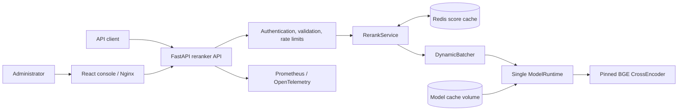

# Reranker Service

[Русский](README.ru.md) | **English**

Reranker Service is an independent FastAPI cross-encoder service and administration console. It
scores domain-agnostic `query + document` pairs with the pinned
`BAAI/bge-reranker-v2-m3@953dc6f` model. It supports CPU and CUDA inference, Redis score caching,
bounded dynamic batching, batch requests, Prometheus/OpenTelemetry observability, and graceful
cache degradation.

## What is included

- authenticated single-request and batch reranking APIs;
- stable ranking that preserves input order when scores are equal;
- one immutable model revision and one active model runtime per container;
- candidate model validation, warm-up, activation, and rollback controls;
- Redis caching with SHA-256-only keys and inference-safe degradation;
- a React administration console with playgrounds, benchmarks, metrics, runtime controls, and
  technical request history;
- CPU and CUDA Docker targets plus a reproducible PowerShell installer.

The API is available at `http://localhost:8200`; the administration console is at
`http://localhost:8400`.

## Architecture

The service follows the compact component-and-data-flow style used by
`job-searching-assistant`: the API owns contracts and orchestration, the runtime owns model
inference, and Redis remains an optional cache rather than a readiness dependency.



The web container only serves the console and reverse-proxies HTTP. FastAPI owns authentication,
validation, request limits, stable response contracts, and technical audit records. `RerankService`
coordinates hashed cache lookup and bounded inference. `DynamicBatcher` combines pairs without
mixing request identity, while `ModelRuntime` owns the single active CrossEncoder and executor.
Redis failures reduce cache effectiveness but never make inference or readiness fail.

## Install from scratch on Windows

Requirements: Windows 10 or 11, PowerShell 5.1 or newer, Docker Desktop with Compose v2, at least
8 GB RAM, and approximately 8 GB free disk space.

```powershell
git clone https://github.com/Sa1avatus/reranker-service.git
Set-Location reranker-service
Set-ExecutionPolicy -Scope Process Bypass
.\scripts\install.ps1
```

The installer verifies Docker, creates an ignored `.env` with independent random API and admin
secrets, builds the CPU-only image, starts Redis/API/web, and waits for the pinned model to download
and warm up. It never overwrites an existing `.env`. The first installation can take 10–30 minutes,
depending on network and CPU speed.

When readiness succeeds, open `http://localhost:8400`. Read the admin token only from your local
`.env`; never paste it into logs or commit it.

```powershell
docker compose ps
docker compose logs -f reranker-api
docker compose down
# Data is preserved. Add -v only when you intentionally want to delete model and Redis volumes.
```

Rerunning `.\scripts\install.ps1` is safe. Use `-SkipBuild` when the image is current, or
`-ReadyTimeoutMinutes 60` on a slow first download.

## Manual quick start

```powershell
Copy-Item .env.example .env
# Replace both placeholder secrets before starting the service.
docker compose up -d --build
Invoke-RestMethod http://localhost:8200/health/ready
```

For local-only development you may use disposable development secrets. Never deploy them.

```powershell
$body = @{
  query = 'Kubernetes experience'
  documents = @(
    @{ id = 'a'; text = 'Ran Kubernetes in production' }
    @{ id = 'b'; text = 'SQL Server administrator' }
  )
  top_n = 2
} | ConvertTo-Json -Depth 4

Invoke-RestMethod -Method Post -Uri http://localhost:8200/v1/rerank `
  -Headers @{ Authorization = 'Bearer <your-local-api-key>' } `
  -ContentType 'application/json' -Body $body
```

## Local development

Python 3.12 is required. Unit tests use a deterministic mock runtime and do not download the
production model.

```powershell
python -m venv .venv
.\.venv\Scripts\python.exe -m pip install -e ".[dev]"
.\.venv\Scripts\python.exe -m ruff check .
.\.venv\Scripts\python.exe -m mypy reranker_service
.\.venv\Scripts\python.exe -m pytest
```

The console uses Node.js 22. Run `npm install`, `npm test`, and `npm run build` from `web/`.

## Operations and safety

- One API worker is deliberate: multiple workers duplicate model memory.
- CPU inference generally needs 2–6 GiB depending on sequence, batch, and concurrency settings.
- CUDA additionally needs weights, activations, and allocator headroom. Reduce max length, batch
  size, or concurrency on OOM.
- Input text, bearer credentials, and unhashed cache inputs are never logged or persisted.
- Public scores are sigmoid-normalized logits and are not comparable across model revisions.

See [API.md](API.md), [ARCHITECTURE.md](ARCHITECTURE.md),
[OPERATIONS.md](OPERATIONS.md), [DEVELOPMENT.md](DEVELOPMENT.md), and
[SECURITY.md](SECURITY.md).
