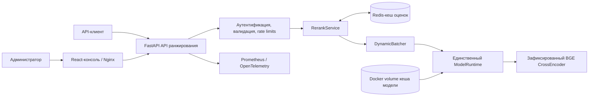

# Reranker Service

**Русский** | [English](README.md)

Reranker Service — независимый сервис cross-encoder ранжирования на FastAPI с административной
консолью. Он оценивает универсальные пары `query + document` с помощью зафиксированной модели
`BAAI/bge-reranker-v2-m3@953dc6f`. Поддерживаются CPU- и CUDA-инференс, кеширование оценок в
Redis, ограниченный динамический batching, пакетные запросы, наблюдаемость через
Prometheus/OpenTelemetry и безопасная деградация кеша.

## Возможности

- защищённые API одиночного и пакетного ранжирования;
- стабильное ранжирование с сохранением исходного порядка при равных оценках;
- одна неизменяемая ревизия и один активный runtime модели в контейнере;
- проверка, прогрев, активация и откат модели-кандидата;
- Redis-кеш с ключами только на основе SHA-256 и деградацией без остановки инференса;
- административная React-консоль с playground, бенчмарками, метриками, runtime-настройками и
  технической историей запросов;
- CPU- и CUDA-варианты Docker-образа и воспроизводимый PowerShell-установщик.

API доступен по адресу `http://localhost:8200`, административная консоль —
`http://localhost:8400`.

## Архитектура

Схема следует компактному стилю компонентов и потоков данных из `job-searching-assistant`: API
владеет контрактами и оркестрацией, runtime — инференсом модели, а Redis остаётся необязательным
кешем и не влияет на readiness.



Web-контейнер только раздаёт консоль и проксирует HTTP. FastAPI отвечает за аутентификацию,
валидацию, лимиты, стабильные контракты ответов и технический аудит. `RerankService` координирует
поиск в хешированном кеше и ограниченный инференс. `DynamicBatcher` объединяет пары, не смешивая
идентичность запросов, а `ModelRuntime` владеет единственным активным CrossEncoder и executor.
Сбой Redis уменьшает эффективность кеша, но не нарушает инференс или readiness.

## Установка с нуля в Windows

Требования: Windows 10 или 11, PowerShell 5.1 или новее, Docker Desktop с Compose v2, минимум
8 ГБ RAM и около 8 ГБ свободного места.

```powershell
git clone https://github.com/Sa1avatus/reranker-service.git
Set-Location reranker-service
Set-ExecutionPolicy -Scope Process Bypass
.\scripts\install.ps1
```

Установщик проверяет Docker, создаёт игнорируемый `.env` с независимыми случайными ключами API и
администратора, собирает CPU-образ, запускает Redis/API/web и ждёт загрузки и прогрева
зафиксированной модели. Существующий `.env` не перезаписывается. Первая установка может занять
10–30 минут в зависимости от сети и CPU.

После успешного readiness откройте `http://localhost:8400`. Читайте токен администратора только из
локального `.env`; не помещайте его в логи и не коммитьте.

```powershell
docker compose ps
docker compose logs -f reranker-api
docker compose down
# Данные сохраняются. Добавляйте -v только для намеренного удаления модели и данных Redis.
```

Повторный запуск `.\scripts\install.ps1` безопасен. Используйте `-SkipBuild`, если образ актуален,
или `-ReadyTimeoutMinutes 60` при медленной первой загрузке.

## Ручной быстрый запуск

```powershell
Copy-Item .env.example .env
# Замените оба секретных значения-заглушки до запуска сервиса.
docker compose up -d --build
Invoke-RestMethod http://localhost:8200/health/ready
```

Для локальной разработки допустимы временные development-секреты. Не используйте их в deployment.

```powershell
$body = @{
  query = 'Опыт работы с Kubernetes'
  documents = @(
    @{ id = 'a'; text = 'Эксплуатация Kubernetes в production' }
    @{ id = 'b'; text = 'Администрирование SQL Server' }
  )
  top_n = 2
} | ConvertTo-Json -Depth 4

Invoke-RestMethod -Method Post -Uri http://localhost:8200/v1/rerank `
  -Headers @{ Authorization = 'Bearer <ваш-локальный-api-ключ>' } `
  -ContentType 'application/json' -Body $body
```

## Локальная разработка

Требуется Python 3.12. Unit-тесты используют детерминированный mock runtime и не загружают
production-модель.

```powershell
python -m venv .venv
.\.venv\Scripts\python.exe -m pip install -e ".[dev]"
.\.venv\Scripts\python.exe -m ruff check .
.\.venv\Scripts\python.exe -m mypy reranker_service
.\.venv\Scripts\python.exe -m pytest
```

Для консоли нужен Node.js 22. Из каталога `web/` выполните `npm install`, `npm test` и
`npm run build`.

## Эксплуатация и безопасность

- Один API worker выбран намеренно: несколько worker дублируют модель в памяти.
- CPU-инференсу обычно нужно 2–6 ГиБ в зависимости от длины последовательностей, batch и
  concurrency.
- CUDA дополнительно требует память под веса, активации и allocator. При OOM уменьшайте max length,
  batch size или concurrency.
- Входной текст, bearer credentials и нехешированные входы кеша не логируются и не сохраняются.
- Публичные оценки — нормализованные сигмоидой logits; их нельзя сравнивать между ревизиями модели.

См. [API.md](API.md), [ARCHITECTURE.md](ARCHITECTURE.md),
[OPERATIONS.md](OPERATIONS.md), [DEVELOPMENT.md](DEVELOPMENT.md) и
[SECURITY.md](SECURITY.md).
