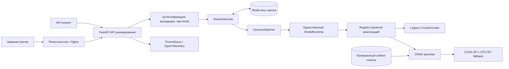

# Reranker Service

**Русский** | [English](README.md)

Reranker Service — независимый сервис cross-encoder ранжирования на FastAPI с административной
консолью. Он оценивает универсальные пары `query + document` с помощью зафиксированной модели
`BAAI/bge-reranker-v2-m3@953dc6f6f85a1b2dbfca4c34a2796e7dde08d41e`. Production path по
умолчанию использует ONNX Runtime CUDA с управляемым CPU fallback. Поддерживаются кеширование оценок в
Redis, ограниченный динамический batching, пакетные запросы, наблюдаемость через
Prometheus/OpenTelemetry и безопасная деградация кеша.

Репозиторий активно развивается и пока не содержит формальных release tags. В
[CHANGELOG.ru.md](CHANGELOG.ru.md) перечислены восстановленные по Git-истории этапы разработки и
текущие незарелизенные изменения.

## Возможности

- защищённые API одиночного и пакетного ранжирования;
- стабильное ранжирование с сохранением исходного порядка при равных оценках;
- одна неизменяемая ревизия и один активный runtime модели в контейнере;
- registry backend-реализаций с типизированными capabilities для ONNX, legacy CrossEncoder,
  Alibaba GTE pairwise и Jina listwise;
- versioned ONNX manifests с SHA-256-проверкой, привязанные к модели, полному SHA ревизии, backend и
  precision;
- проверка, прогрев, активация и откат модели-кандидата;
- Redis-кеш с ключами только на основе SHA-256 и деградацией без остановки инференса;
- административная React-консоль с playground, бенчмарками, метриками, runtime-настройками и
  технической историей запросов с раскрывающимися деталями (query, результаты ранжирования, документы);
- локальное хранение в браузере данных Playground и Batch Playground (query, документы, metadata,
  top-N); включено по умолчанию, можно отключить чекбоксом «Remember inputs in this browser»;
- изолированные ONNX GPU, ONNX CPU, exporter, legacy, Jina и Alibaba Docker targets;
- воспроизводимый PowerShell-установщик.

Локально API доступен по адресу `http://localhost:8200`, а из доверенной локальной сети — по адресу
`http://192.168.1.93:8200`. Административная консоль доступна по адресам
`http://localhost:8400` и `http://192.168.1.93:8400` соответственно. Для обоих интерфейсов нужны
настроенные bearer credentials. Redis и диагностические порты multi-backend остаются привязаны к
loopback.

## Область ответственности

Реранкер — это **чистый сервис ранжирования по релевантности**. Он отвечает на один вопрос:

> Насколько данный фрагмент evidence релевантен конкретному atomic claim?

Реранкер **НЕ**:
- рассчитывает итоговый match score вакансии;
- решает, выполнено ли требование (SUPPORTED / PARTIAL / UNKNOWN / CONTRADICTED);
- проверяет длительность опыта;
- применяет mandatory/blocker penalties;
- определяет commercial/production experience;
- рассчитывает итоговый процент 0–100%;
- знает веса требований вакансии.

Эти функции принадлежат **Matching Engine** в составе downstream-сервиса
`job-searching-assistant`.

`score` означает **семантическую/cross-encoder релевантность evidence к query**.
Это не match probability, не requirement coverage и не candidate score.
`normalized_score` — опциональная model-specific маппинг `score` в [0, 1]
(например, sigmoid для logit-based backend). API также принимает `top_k` как
backward-compatible алиас для `top_n`.

## Архитектура

Схема следует компактному стилю компонентов и потоков данных из `job-searching-assistant`: API
владеет контрактами и оркестрацией, runtime — инференсом модели, а Redis остаётся необязательным
кешем и не влияет на readiness.



Web-контейнер только раздаёт консоль и проксирует HTTP. FastAPI отвечает за аутентификацию,
валидацию, лимиты, стабильные контракты ответов и технический аудит. `RerankService` координирует
поиск в хешированном кеше и ограниченный инференс. `DynamicBatcher` объединяет пары, не смешивая
идентичность запросов, а `ModelRuntime` владеет единственным активным CrossEncoder и executor.
Framework-specific загрузка, прогрев, проверка provider, rerank и выгрузка остаются внутри каждого
backend. Сбой Redis уменьшает эффективность кеша, но не нарушает инференс или readiness.

## Установка с нуля в Windows

Требования: Windows 10 или 11, PowerShell 5.1 или новее, Docker Desktop с Compose v2, минимум
8 ГБ RAM и около 12 ГБ свободного места для exporter, runtime и artifact модели.

```powershell
git clone https://github.com/Sa1avatus/reranker-service.git
Set-Location reranker-service
Set-ExecutionPolicy -Scope Process Bypass
.\scripts\install.ps1
```

Установщик проверяет Docker, создаёт игнорируемый `.env` с независимыми случайными ключами API и
администратора, явно готовит immutable ONNX artifact через exporter, собирает GPU runtime,
запускает Redis/API/web и ждёт локальной загрузки и прогрева. Существующий `.env` не
перезаписывается. Для хоста без NVIDIA passthrough используйте `.\scripts\install.ps1 -Cpu`.
Первая установка может занять 10–30 минут в зависимости от сети и CPU.

После успешного readiness откройте `http://localhost:8400`. Читайте токен администратора только из
локального `.env`; не помещайте его в логи и не коммитьте.

```powershell
docker compose ps
docker compose logs -f reranker-api
docker compose down
# Данные сохраняются. Добавляйте -v только для намеренного удаления модели и данных Redis.
```

Повторный запуск `.\scripts\install.ps1` безопасен. Используйте `-SkipBuild`, если образ актуален,
или `-ReadyTimeoutMinutes 60` при медленной первой загрузке.

## Ручной быстрый запуск

```powershell
Copy-Item .env.example .env
# Замените оба секретных значения-заглушки до запуска сервиса.
docker compose --profile exporter build reranker-exporter
docker compose --profile exporter run --rm reranker-exporter `
  --model-id BAAI/bge-reranker-v2-m3 `
  --revision 953dc6f6f85a1b2dbfca4c34a2796e7dde08d41e `
  --precision fp32 `
  --score-transform sigmoid
docker compose up -d --build
Invoke-RestMethod http://localhost:8200/health/ready
```

Для локальной разработки допустимы временные development-секреты. Не используйте их в deployment.

```powershell
$body = @{
  query = 'Опыт работы с Kubernetes'
  documents = @(
    @{ id = 'a'; text = 'Эксплуатация Kubernetes в production' }
    @{ id = 'b'; text = 'Администрирование SQL Server' }
  )
  top_n = 2
} | ConvertTo-Json -Depth 4

Invoke-RestMethod -Method Post -Uri http://localhost:8200/v1/rerank `
  -Headers @{ Authorization = 'Bearer <ваш-локальный-api-ключ>' } `
  -ContentType 'application/json' -Body $body
```

## Локальная разработка

Требуется Python 3.12. Unit-тесты используют детерминированный mock runtime и не загружают
production-модель.

```powershell
python -m venv .venv
.\.venv\Scripts\python.exe -m pip install -e ".[legacy,dev]"
.\.venv\Scripts\python.exe -m ruff check .
.\.venv\Scripts\python.exe -m mypy reranker_service
.\.venv\Scripts\python.exe -m pytest
```

Для консоли нужны Node.js 22 и pnpm. Из каталога `web/` выполните `corepack enable`,
`pnpm install --frozen-lockfile`, `pnpm test` и `pnpm run build`.

## ONNX artifact и GPU-контур

API-контейнер не скачивает и не экспортирует модели. Отдельный target `exporter` принимает только модель из allowlist, преобразует `main`, tag, branch или короткий SHA в полный неизменяемый 40-символьный commit SHA, запускает Optimum-валидацию и сохраняет `model.onnx`, `tokenizer.json` и versioned manifest с SHA-256 checksums. Параметр `--score-transform` обязателен, потому что нормализация score зависит от конкретной модели.

```powershell
docker compose --profile exporter run --rm reranker-exporter `
  --model-id BAAI/bge-reranker-v2-m3 `
  --revision 953dc6f6f85a1b2dbfca4c34a2796e7dde08d41e `
  --precision fp32 `
  --score-transform sigmoid
```

GPU runtime запускается через `docker-compose.gpu.yml`, использует ONNX Runtime 1.26.0, CUDA 12.8 и cuDNN 9 и не содержит PyTorch/SentenceTransformers. Перед CUDA он отдельно проверяет artifact и короткий inference на CPU, поэтому повреждённая модель не маскируется fallback. В режиме `device=auto` ошибка инициализации CUDA переводит уже проверенную модель на CPU, если fallback разрешён; readiness остаётся успешным, но возвращает `degraded=true` и причину. Принудительный `device=cuda` завершается fail-closed. Для CPU используйте самостоятельный стек `docker compose -f docker-compose.cpu.yml up -d --build`.

```powershell
docker compose -f docker-compose.yml -f docker-compose.gpu.yml up -d --build
Invoke-RestMethod http://localhost:8200/health/ready
```

Базовый Compose использует проверенный ONNX GPU target с `device=auto`. Самостоятельный CPU-стек не запрашивает GPU и выбирает `CPUExecutionProvider`; legacy CrossEncoder остаётся отдельным target для parity и rollback. Admin UI и API показывают backend, requested/resolved revision, active/available providers, GPU name, fallback provider и degraded reason.

## Альтернативные модели

Jina v3 и Alibaba GTE запускаются только через отдельные opt-in Compose overrides с неизменяемыми
SHA модели, явным `RERANKER_TRUST_REMOTE_CODE=true` и точным allowlist:

```powershell
docker compose -f docker-compose.yml -f docker-compose.jina.yml up -d --build
docker compose -f docker-compose.yml -f docker-compose.alibaba.yml up -d --build
```

`jina_listwise` выполняет настоящий listwise inference для полного упорядоченного набора до 64
документов. Для него отключены pair-cache и batching разных запросов. Сырая оценка — cosine
similarity, normalized score переводит диапазон `[-1, 1]` в `[0, 1]`. Лицензия Jina v3 —
CC-BY-NC-4.0, поэтому перед использованием нужна отдельная проверка условий.

`alibaba_gte` использует изолированный Transformers 4.39.1 и фиксирует как SHA модели, так и SHA
вторичного репозитория `Alibaba-NLP/new-impl`; logit нормализуется sigmoid. Qwen3 Reranker, Ettin и
MiniLM проверены в отдельном `runtime-legacy`. Эти runtime не входят в ONNX production image по
умолчанию.

## Multi-backend стек для разработки

`docker-compose.multi.yml` содержит отдельные определения Jina, Alibaba и legacy CrossEncoder,
потому что их версии зависимостей нельзя безопасно объединить в одном runtime image. Одновременно
запускается только один backend, поэтому память GPU может занимать только одна модель. Nginx proxy
публикует выбранный backend по адресу `http://localhost:8200`:

| Выбор | Backend | Прямой диагностический порт |
| --- | --- | ---: |
| `jina` | `jina_listwise` | `8210` |
| `alibaba` | `alibaba_gte` | `8211` |
| `legacy` | `legacy_cross_encoder` | `8212` |

```powershell
./scripts/select-backend.ps1 legacy  # или jina / alibaba
Invoke-RestMethod http://localhost:8200/v1/backends
```

Selector сначала останавливает все три model services, а затем запускает выбранный. Поэтому смена
выбора в UI не может оставить другую модель в GPU. Переключение backend намеренно выполняется при
старте, а не через `X-Backend` для каждого запроса. Стек может исполнять явно разрешённый remote
model code, поэтому используйте его только на доверенном хосте.

## Эксплуатация и безопасность

- Один API worker выбран намеренно: дополнительные workers дублируют модель в памяти.
- CPU inference обычно требует 2–6 ГиБ в зависимости от длины, batch и concurrency.
- CUDA дополнительно требует память под веса, activations и allocator headroom. При OOM сначала
  уменьшайте max length, затем batch size или concurrency.
- Тексты запросов, bearer credentials и нехешированные входы кеша не записываются в application
  logs. Ограниченные previews в admin history живут только в памяти процесса. Сохранение данных
  Playground и Batch Playground в браузере включено по умолчанию и может быть отключено чекбоксом.
- `score` использует семантику конкретного backend: pairwise logit для стандартных backend и cosine
  similarity для Jina listwise. `normalized_score` заполняется только при наличии обоснованной
  model-specific нормализации; оценки разных моделей и ревизий напрямую несопоставимы.

См. [API.md](API.md), [ARCHITECTURE.md](ARCHITECTURE.md),
[OPERATIONS.md](OPERATIONS.md), [DEVELOPMENT.md](DEVELOPMENT.md) и
[SECURITY.md](SECURITY.md). Воспроизводимые измерения приведены в
[BENCHMARKS.md](BENCHMARKS.md), история изменений — в
[CHANGELOG.ru.md](CHANGELOG.ru.md).
